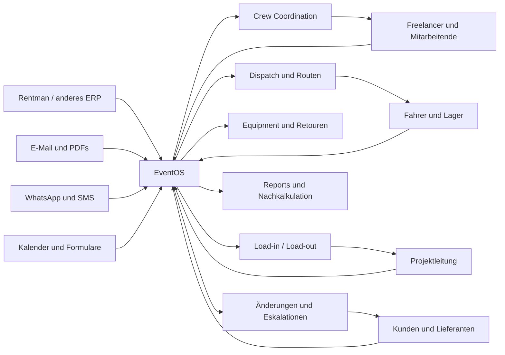
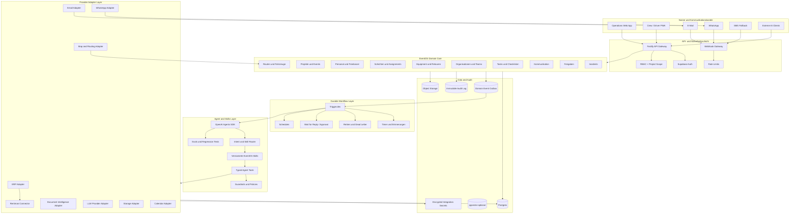
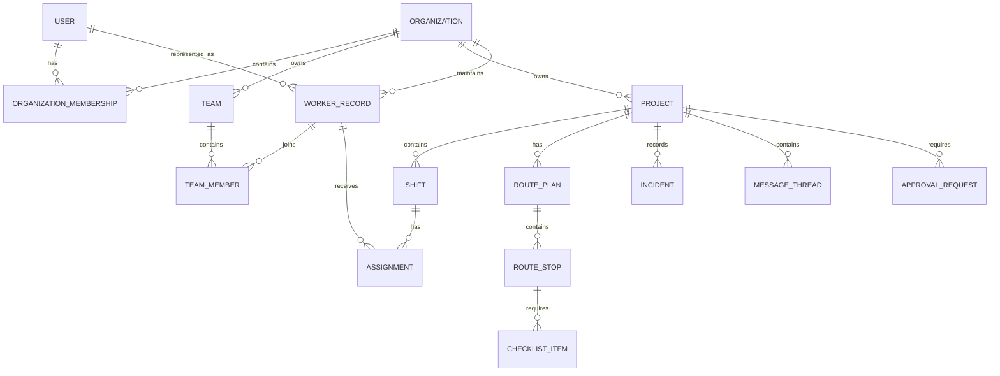
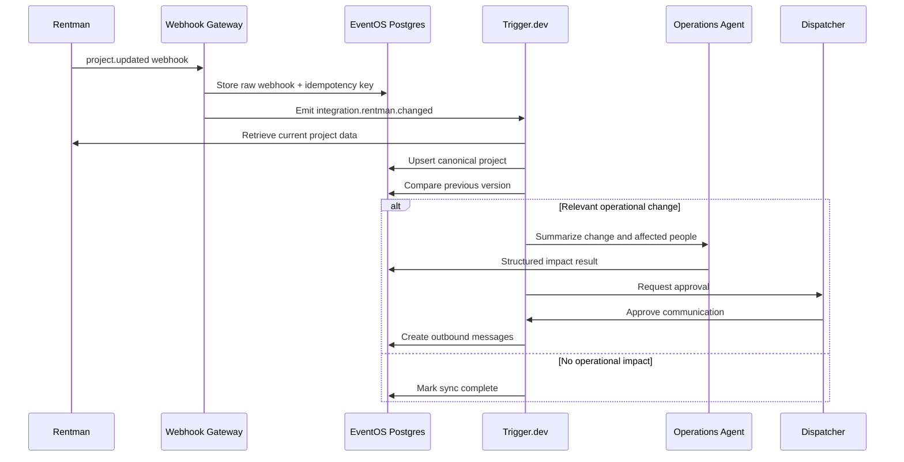
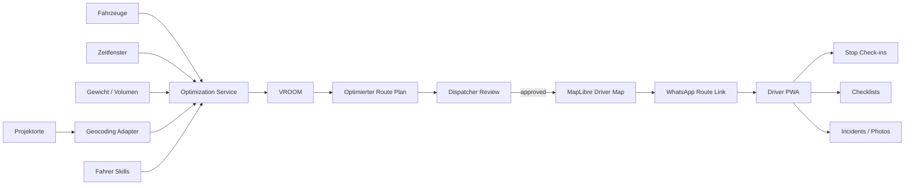
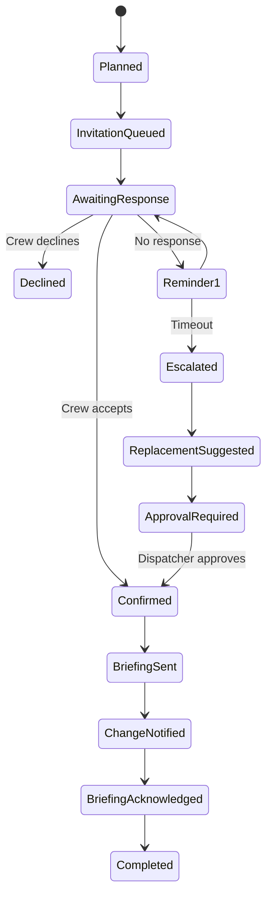
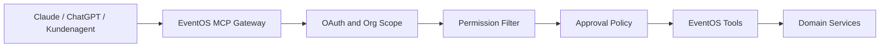

# EventOS – endgültige Zielarchitektur 2026–2027

## Zentrale Entscheidung

**EventOS wird workflow-first und agent-enhanced gebaut.**

Das bedeutet:

* **Trigger.dev** führt langlebige, zuverlässige Geschäftsprozesse aus.
* **Postgres** hält den verbindlichen Systemzustand.
* **OpenAI Agents SDK für TypeScript** verarbeitet Sprache, Dokumente, Nachrichten und begrenzte Planung.
* **Deterministische Services** berechnen Routen, Verfügbarkeiten, Fristen, Kapazitäten und Berechtigungen.
* **Menschen genehmigen** Personalumbuchungen, Kosten, verbindliche Kundenkommunikation und sicherheitsrelevante Entscheidungen.
* **Provider-Adapter** machen Rentman, WhatsApp, Routing, E-Mail und AI austauschbar.
* **MCP** wird später als sichere externe AI-Schnittstelle angeboten, nicht als interner Systembus.

LangGraph und ein komplexes Multi-Agent-System sind für den MVP **nicht erforderlich**. LangGraph bietet zwar persistente Graphen, Human-in-the-loop und unterbrechbare Ausführung, würde aber neben Trigger.dev zunächst dieselbe Orchestrierungsebene teilweise doppeln. ([Docs by LangChain][1])

---

# 1. Das eigentliche EventOS-Produkt

EventOS sitzt zwischen vorhandenen Systemen und der chaotischen Realität:



EventOS ersetzt Rentman nicht. Rentman bietet bereits eine öffentliche API und seit 2026 Webhooks, über die Änderungen an Projekten, Kontakten und anderen Entitäten ohne permanentes Polling übertragen werden können. ([support.rentman.io][2])

EventOS schliesst vielmehr diesen Kreislauf:

```text
Planung im ERP
→ Kommunikation
→ Bestätigung
→ operative Ausführung
→ Abweichung
→ Eskalation
→ Dokumentation
→ Rückschreiben ins ERP
```

---

# 2. Empfohlener Technologie-Stack

| Ebene              | Finale Wahl                           | Aufgabe                                        |
| ------------------ | ------------------------------------- | ---------------------------------------------- |
| Web-App            | Next.js, TypeScript, PWA              | Disposition, Admin, Fahrer- und Crew-Portal    |
| Backend            | Fastify, modularer Monolith           | APIs, Berechtigungen, Domainlogik              |
| Datenbank          | Supabase Postgres                     | Verbindliche Daten und Mandantentrennung       |
| Auth               | Supabase Auth                         | Login, Magic Links, später SAML/OIDC           |
| Dateispeicher      | S3-kompatibler Storage                | PDFs, Fotos, Lieferscheine, Reports            |
| Business-Workflows | Trigger.dev                           | Timer, Erinnerungen, Retries, Warteschritte    |
| Agent Runtime      | OpenAI Agents SDK TS                  | Klassifikation, Extraktion, Texte, Agent-Tools |
| AI-Provider        | OpenAI als Standard, Provider Gateway | später Anthropic, Gemini, BYO-Key              |
| Karten-UI          | MapLibre GL JS                        | OSM-basierte interaktive Karten                |
| Routing            | openrouteservice                      | Strecke, Zeit, Distanz, Matrix                 |
| Optimierung        | VROOM                                 | Fahrzeug- und Stoppreihenfolge                 |
| WhatsApp           | Meta Cloud API                        | Crew-, Fahrer- und Kundenkommunikation         |
| E-Mail             | Microsoft Graph + Gmail Adapter       | Kunden- und Projektkommunikation               |
| Observability      | OpenTelemetry + Sentry                | Fehler, Performance, Workflow-Monitoring       |
| Verträge           | OpenAPI + Zod                         | typisierte Schnittstellen                      |
| Monorepo           | pnpm + Turborepo                      | gemeinsamer Code und schnelle Entwicklung      |

Supabase RLS kann Datenzugriff auf Datenbankebene pro Benutzer und Organisation absichern. Supabase unterstützt ausserdem mehrere SAML-Verbindungen für unterschiedliche Mandanten. ([Supabase][3])

Trigger.dev passt für den Start besser als Temporal, weil es TypeScript-native, verwaltet und auf AI- sowie langlebige Workflows ausgerichtet ist. Es bietet Warteschritte, Retries, Queues, Idempotency und Human-in-the-loop, ohne dass EventOS eigene Worker-Infrastruktur aufbauen muss. Eine Self-hosted-Variante bleibt später möglich. ([trigger.dev][4])

---

# 3. Gesamte Systemarchitektur



---

# 4. Die entscheidende Trennung

## A. Domain Core

Der Domain Core entscheidet:

* Wer zu welcher Organisation gehört
* wer ein Projekt sehen darf
* welche Person eingeplant ist
* ob eine Schicht bestätigt wurde
* welche Checkliste offen ist
* welcher Status verbindlich gilt
* ob eine Aktion genehmigungspflichtig ist

Der Domain Core enthält **keine LLM-Entscheidungen**.

## B. Workflow Engine

Trigger.dev steuert:

* „Sende Einsatzanfrage“
* „Warte zwei Stunden“
* „Falls keine Antwort: Erinnerung“
* „Falls weiterhin keine Antwort: Disposition informieren“
* „Warte auf Freigabe“
* „Schreibe bestätigte Änderung zurück“
* „Erzeuge am nächsten Morgen einen Report“

## C. Agent Layer

AI übernimmt:

* Nachricht verstehen
* Projekt und Person erkennen
* Zusage, Absage oder Rückfrage klassifizieren
* Informationen aus PDFs und Freitext extrahieren
* ein Briefing verständlich formulieren
* Änderungen zusammenfassen
* Konflikte erklären
* eine Antwort vorschlagen
* Incidents strukturieren

## D. Deterministische Services

Klassischer Code übernimmt:

* Zeitüberschneidungen
* Arbeitszeitregeln
* Rollen und Berechtigungen
* Kapazitätsgrenzen
* Fahrzeuggewicht und -volumen
* Routenberechnung
* Optimierungsparameter
* Preisberechnung
* Fristen
* Audit
* Idempotency
* Synchronisierung

---

# 5. Agenten-, Skill- und Workflow-Modell

## Kein Team aus 20 künstlichen Agenten

Für den Start genügt ein zentraler **Operations Agent**, der nur freigegebene Skills und Tools verwenden darf.

Später können drei begrenzte Agenten entstehen:

1. **Operations Intake Agent**
   Versteht E-Mails, WhatsApp-Nachrichten, Dokumente und Änderungen.

2. **Coordination Agent**
   Erstellt Briefings, Rückfragen, Erinnerungen und Eskalationsvorschläge.

3. **Reporting Agent**
   Erstellt Projektzusammenfassungen, Incident Reports und Nachkalkulationshinweise.

Die OpenAI Agents SDK unterstützt typisierte Tools, strukturierte Outputs, Guardrails, Tracing, Handoffs und MCP-Tools. ([OpenAI GitHub Pages][5])

## EventOS Skills

```text
packages/agents/skills/
├── classify-message/
│   ├── SKILL.md
│   ├── schema.ts
│   ├── policy.yaml
│   ├── examples.json
│   └── evals.json
├── extract-project-change/
├── generate-crew-briefing/
├── process-crew-response/
├── summarize-incident/
├── generate-client-update/
├── reconcile-return-note/
└── explain-route-plan/
```

Jeder Skill enthält:

```yaml
name: process-crew-response
version: 1.2.0
purpose: Classify a crew member response
allowed_tools:
  - read_assignment
  - create_response_record
  - request_dispatch_review
forbidden_actions:
  - assign_replacement
  - modify_compensation
  - send_customer_message
approval_policy: review_on_low_confidence
output_schema: CrewResponseResult
```

## Skill Output

```json
{
  "classification": "confirmed",
  "confidence": 0.97,
  "assignmentId": "assignment_123",
  "extractedArrivalTime": "2026-08-14T06:45:00+02:00",
  "questions": [],
  "requiresHumanReview": false
}
```

## Agency-Agents-Repository

`msitarzewski/agency-agents` ist nützlich für:

* Entwicklungsrollen
* Code Reviews
* Produktstrategie
* QA
* Security Review
* Dokumentation

Es sollte aber **nicht als EventOS Runtime** eingebaut werden. Das Repository beschreibt seine Markdown-Dateien selbst als nicht ausführbare Promptdefinitionen. ([GitHub][6])

Sinnvolle Entwicklungsagenten daraus:

* Senior Project Manager
* Product Manager
* Reality Checker
* Backend Architect
* Security Engineer
* QA Engineer
* Infrastructure Maintainer

Die EventOS-Produkt-Skills müssen dagegen kurz, domain-spezifisch, getestet und mit klaren Toolrechten versehen sein.

---

# 6. Wann EventOS AI verwenden darf

| Aufgabe                     |        AI |                        Regelcode |                 Mensch |
| --------------------------- | --------: | -------------------------------: | ---------------------: |
| E-Mail klassifizieren       |        Ja |                      Validierung |   nur bei Unsicherheit |
| PDF-Daten extrahieren       |        Ja |                   Schema-Prüfung |           bei Konflikt |
| Zusage erkennen             |        Ja |                Assignment prüfen |     bei Mehrdeutigkeit |
| Erinnerung formulieren      |        Ja |      Workflow bestimmt Zeitpunkt |                   nein |
| Person automatisch ersetzen | Vorschlag |             Verfügbarkeit prüfen |     zwingende Freigabe |
| Route berechnen             |      nein |                               ja |   Freigabe durch Dispo |
| Route erklären              |        ja |         Route bleibt unverändert |               optional |
| Bestellung auslösen         |      nein | Kosten- und Berechtigungsprüfung |               zwingend |
| Arbeitszeit freigeben       |      nein |                       Berechnung |               zwingend |
| Incident zusammenfassen     |        ja |                Felder validieren |   Projektleitung prüft |
| Sicherheitsentscheidung     |      nein |               Checklisten/Regeln | verantwortliche Person |

---

# 7. Multi-Organisation-, Team- und Freelancer-Modell

## Mandantenstruktur



## Zentrale Tabellen

### Mandanten und Benutzer

* `organizations`
* `organization_settings`
* `users`
* `organization_memberships`
* `roles`
* `permissions`
* `teams`
* `team_members`

### Personal

* `worker_records`
* `worker_skills`
* `worker_certifications`
* `worker_availability`
* `worker_contact_channels`
* `worker_emergency_contacts`
* `worker_preferences`

Ein Freelancer kann einen globalen Login besitzen, erhält aber für jede Organisation einen separaten `worker_record`. Dadurch können zwei Kunden dieselbe Person einsetzen, ohne gegenseitig Daten, Bewertungen, Löhne oder Einsätze zu sehen.

### Projekte und operative Planung

* `projects`
* `project_phases`
* `locations`
* `shifts`
* `assignments`
* `assignment_responses`
* `vehicles`
* `equipment_items`
* `equipment_movements`
* `tasks`
* `checklists`

### Kommunikation und Automation

* `conversations`
* `messages`
* `message_classifications`
* `workflow_runs`
* `agent_runs`
* `approval_requests`
* `notifications`
* `integration_accounts`
* `sync_cursors`
* `webhook_events`
* `audit_events`

## Rollen

* Organisation Owner
* Admin
* Operations Manager
* Dispatcher
* Project Manager
* Warehouse Manager
* Driver
* Internal Crew
* Freelancer
* Client Observer
* Finance Reviewer
* Integration Service Account

Zusätzlich zur Rolle gelten Objektgrenzen:

```text
Organisation
→ Team
→ Projekt
→ Schicht
→ Assignment
```

Ein Freelancer darf beispielsweise nur seine eigenen Einsätze, Briefings, Routen und Checklisten sehen.

---

# 8. Provider- und Connector-Architektur

## Grundregel

Der EventOS Core kennt niemals direkt die Rentman-, Meta- oder ORS-Datenmodelle.

```typescript
interface ProjectSystemAdapter {
  connect(input: ConnectionInput): Promise<ConnectionResult>;
  verifyConnection(): Promise<HealthResult>;

  getProject(externalId: string): Promise<CanonicalProject>;
  listChangedProjects(cursor?: string): Promise<SyncPage<CanonicalProject>>;
  getAssignments(projectId: string): Promise<CanonicalAssignment[]>;

  updateAssignmentStatus(
    externalId: string,
    status: AssignmentStatus
  ): Promise<WriteResult>;

  registerWebhooks(): Promise<WebhookRegistration[]>;
}
```

## Canonical EventOS Model

```typescript
type CanonicalAssignment = {
  externalId: string;
  projectExternalId: string;
  workerExternalId?: string;
  role: string;
  startAt: string;
  endAt: string;
  location: CanonicalLocation;
  status: "planned" | "requested" | "confirmed" | "declined";
  sourceSystem: string;
  sourceUpdatedAt: string;
};
```

## Adapterpakete

```text
packages/connectors/
├── core/
│   ├── project-system.ts
│   ├── messaging.ts
│   ├── email.ts
│   ├── routing.ts
│   ├── geocoding.ts
│   ├── document-ai.ts
│   └── storage.ts
├── rentman/
├── generic-csv/
├── meta-whatsapp/
├── microsoft-graph/
├── gmail/
├── openrouteservice/
├── vroom/
├── maplibre/
├── aws-textract/
└── openai/
```

## Priorität

### MVP

* Rentman
* generischer CSV-/Excel-Import
* Meta WhatsApp Cloud API
* Microsoft Graph
* Gmail
* openrouteservice
* MapLibre
* OpenAI
* S3 Storage

### Später

* Current RMS
* easyjob
* Flex Rental Solutions
* HubSpot
* Salesforce
* Abacus
* Bexio
* Personio
* Twilio SMS
* Telematik- und Fahrzeuganbieter

---

# 9. Rentman-Synchronisierung



## Konfliktregeln

Jede synchronisierte Entität erhält:

* `source_system`
* `external_id`
* `source_version`
* `source_updated_at`
* `last_synced_at`
* `local_override`
* `sync_status`

Schreibvorgänge benötigen:

* Idempotency Key
* erwartete externe Version
* Audit-Eintrag
* Retry-Policy
* Konfliktstatus statt blindem Überschreiben

---

# 10. WhatsApp-first, aber nicht WhatsApp-only

WhatsApp ist die primäre Oberfläche für externe Crew und Fahrer. Die alte WhatsApp On-Premises API kann seit Oktober 2025 nicht mehr zum Versand verwendet werden; EventOS sollte deshalb die Cloud API oder einen Cloud-API-Provider nutzen. ([Facebook Developers][7])

## Kommunikationslogik

```text
EventOS Message
    ├── WhatsApp verfügbar und Opt-in vorhanden
    │      └── WhatsApp Cloud API
    ├── kein WhatsApp
    │      └── SMS
    └── längere Dokumente / formale Kommunikation
           └── E-Mail
```

## Beispiel Crew-Nachricht

```text
Hallo Mario

neuer Einsatz zur Bestätigung:

Projekt: Messeaufbau Zürich
Datum: 14. August
Treffpunkt: Halle 4, Tor B
Zeit: 06:45–18:00
Rolle: Stagehand / Load-in
Kleidung: Sicherheitsschuhe und schwarze Arbeitskleidung

[Bestätigen] [Ablehnen] [Frage stellen]

Briefing und Route:
eventos.app/r/7xK...
```

Freie Textantworten wie „Bin dabei, komme aber wahrscheinlich 10 Minuten später“ werden strukturiert als:

```json
{
  "status": "confirmed",
  "arrivalDeviationMinutes": 10,
  "requiresDispatcherReview": true
}
```

---

# 11. Route Planning und Fahrer-PWA

MapLibre GL JS ist eine TypeScript/WebGL-Bibliothek zur Darstellung interaktiver Karten. openrouteservice berechnet Strecken für verschiedene Transportmodi; dessen öffentlicher Optimierungsdienst verwendet VROOM für Vehicle-Routing-Probleme. ([giscience.github.io][8])

## Architektur



## Routing-Eingaben

* Start- und Enddepot
* Fahrzeugtyp
* Ladekapazität
* Equipmentgewicht und -volumen
* Fahrerqualifikationen
* Arbeitszeit
* Pausenzeiten
* Ladezeit pro Stopp
* feste Zeitfenster
* Abholungen
* Lieferungen
* Prioritäten
* gekoppelte Pickup-/Delivery-Aufträge
* Zufahrtsbeschränkungen
* benötigte Skills

## Wichtige Regel

Das LLM berechnet **nicht** die Route.

VROOM beziehungsweise der Routing-Service liefert:

* Stoppreihenfolge
* Fahrzeiten
* Distanzen
* Ankunftsprognosen
* nicht zuordenbare Stops
* Kapazitätskonflikte

AI darf anschliessend erklären:

> „Fahrzeug 2 kann Stopp 5 nicht übernehmen, weil das erwartete Equipmentvolumen die verfügbare Kapazität überschreitet.“

## Driver Route Run

Für jede ausgeführte Route wird ein unveränderlicher Plan erzeugt:

```text
RoutePlan
└── RouteRun
    ├── Driver
    ├── Vehicle
    ├── Version
    ├── Stops
    ├── Planned ETA
    ├── Actual arrival
    ├── Checklist
    ├── Proof of delivery
    ├── Photos
    ├── Incident
    └── Completion status
```

## Fahreroberfläche

```text
06:30  Depot Sulgen
        □ Fahrzeug geprüft
        □ Material vollständig
        □ Ladefoto hochgeladen

07:25  Messe Zürich – Tor B
        Navigation starten
        □ Vor Ort angekommen
        □ Ansprechpartner informiert
        □ 12 Cases abgeladen
        □ Übergabe bestätigt

09:10  Eventhalle Winterthur
        Navigation starten
        □ Material übernommen
        □ Abweichung melden
```

## Versand

Der Fahrer erhält per WhatsApp:

* Kartenlink
* Startzeit
* Gesamtfahrzeit
* erwartete Rückkehr
* Fahrzeug
* Ansprechpartner
* Stoppliste
* Checkliste
* Notfallkontakt

Der Link verwendet ein zeitlich begrenztes, personengebundenes Token. Kein öffentlich erratbarer Projektlink.

## Live-Tracking

Für den MVP:

* kein permanentes GPS-Tracking
* Check-in bei Abfahrt und Ankunft
* optionaler Standort beim Check-in
* neue ETA anhand tatsächlicher Fortschritte

Später:

* freiwilliges Live-Tracking nur während der aktiven Schicht
* klare Information und Aufbewahrungsfrist
* abschaltbar pro Organisation

Das Schweizer Datenschutzgesetz gilt direkt auch für AI-gestützte Datenverarbeitung; Cloud-Outsourcing muss anhand der verarbeiteten Daten und ihrer Sensitivität geprüft und abgesichert werden. ([FDPIC][9])

---

# 12. Kernworkflows

## Workflow 1: Crew Confirmation



### AI-Aufgaben

* freie Antwort interpretieren
* Rückfragen erkennen
* Änderungen verständlich erklären
* Briefing personalisieren

### Regelaufgaben

* Timeout
* Verfügbarkeit
* Überschneidung
* Rollenqualifikation
* Freigabe
* Statusänderung

---

## Workflow 2: Project Change Control

```text
Rentman-Änderung erkannt
→ alte und neue Version vergleichen
→ betroffene Personen/Materialien/Routen bestimmen
→ Auswirkungen zusammenfassen
→ kritische Änderung markieren
→ Disposition genehmigt
→ Nachrichten senden
→ Bestätigungen einsammeln
→ fehlende Reaktionen eskalieren
→ Audit abschliessen
```

Kritische Änderungen:

* Datum
* Einsatzzeit
* Treffpunkt
* Lohn-/Spesenrelevanz
* Fahrzeug
* Rolle
* Sicherheitsanforderung
* Projektabsage

---

## Workflow 3: Load-in / Load-out

```text
Route gestartet
→ Depotcheckliste
→ Material geladen
→ Abfahrt
→ Ankunft
→ Abladen
→ Mengen bestätigen
→ Abweichungen fotografieren
→ Ansprechpartner bestätigt Übergabe
→ Rückfahrt
→ Retourenprüfung
→ Differenzbericht
```

---

## Workflow 4: Incident Handling

```text
Crew sendet Text, Sprache oder Foto
→ Projekt und Ort erkennen
→ Incident-Typ klassifizieren
→ Schweregrad vorschlagen
→ Sofortregeln ausführen
→ verantwortliche Person alarmieren
→ Informationen nachfordern
→ Incident Report erstellen
→ Abschluss dokumentieren
```

AI darf den Schweregrad vorschlagen. Sicherheitsrelevante Einstufung und Abschluss erfolgen durch einen Menschen.

---

## Workflow 5: End-of-Day Report

Automatisch nach Projektende:

* geplante versus bestätigte Crew
* No-Shows
* Verspätungen
* Überstunden
* Routenabweichungen
* fehlendes Material
* beschädigtes Material
* offene Retouren
* Incidents
* Kundenänderungen
* offene Freigaben
* geschätzte vermeidbare Mehrkosten

---

# 13. Human-in-the-loop

Freigaben sind eigene Domainobjekte, nicht Chatnachrichten:

```typescript
type ApprovalRequest = {
  id: string;
  organizationId: string;
  projectId?: string;
  actionType:
    | "replace_worker"
    | "send_binding_message"
    | "change_route"
    | "create_purchase"
    | "write_external_system"
    | "close_incident";
  proposedPayload: unknown;
  riskLevel: "low" | "medium" | "high";
  requestedBy: "workflow" | "agent" | "user";
  status: "pending" | "approved" | "rejected" | "expired";
  expiresAt?: string;
};
```

Die Agent SDK kann Tools und Agenten mit Guardrails versehen. Trotzdem müssen Kosten-, Sicherheits- und Schreibfreigaben zusätzlich durch die EventOS-Domainlogik geschützt werden; Promptregeln allein sind keine Autorisierung. ([OpenAI GitHub Pages][10])

---

# 14. MCP-Strategie

## Nicht für interne Kommunikation

Nicht:

```text
Backend → MCP → eigener Service → Datenbank
```

Das erzeugt unnötige Komplexität.

Intern verwendet EventOS direkte, typisierte Services.

## MCP als externe Schnittstelle



Mögliche MCP-Tools:

* `list_projects`
* `get_project_status`
* `get_unconfirmed_assignments`
* `get_route_plan`
* `draft_project_update`
* `create_task`
* `request_crew_message`
* `summarize_incidents`

Schreibende Tools:

* standardmässig deaktiviert
* Freigabe erforderlich
* organisations- und projektgebunden
* vollständig auditiert

Die OpenAI Agents SDK unterstützt gehostete, Streamable-HTTP- und lokale MCP-Server. Für neue Integrationen wird Streamable HTTP gegenüber dem älteren SSE-Transport bevorzugt. ([OpenAI GitHub Pages][11])

---

# 15. Sicherheitsarchitektur

## Mandantentrennung

Jede relevante Tabelle enthält:

```text
organization_id UUID NOT NULL
```

RLS-Regel sinngemäss:

```sql
organization_id IN (
  SELECT organization_id
  FROM organization_memberships
  WHERE user_id = auth.uid()
  AND status = 'active'
)
```

Zusätzliche Projektregeln verhindern, dass Freelancer alle Projekte einer Organisation sehen.

## Integration Secrets

* verschlüsselt gespeichert
* niemals an den Browser übertragen
* getrennt nach Organisation
* rotierbar
* Zugriffe auditiert
* minimale Provider-Scopes

## Webhooks

Jeder eingehende Webhook wird:

1. signaturgeprüft,
2. roh gespeichert,
3. mit Idempotency Key versehen,
4. asynchron verarbeitet,
5. bei Fehlern erneut versucht,
6. gegebenenfalls in eine Dead-Letter-Queue verschoben.

## AI-Datenschutz

* Kundendaten nicht für Training freigeben
* minimale Kontextübergabe an Modelle
* personenbezogene Daten nach Möglichkeit pseudonymisieren
* AI-Logs getrennt von operativen Audit-Logs
* konfigurierbare Aufbewahrungsfristen
* Provider je Organisation auswählbar
* private Deployment-Option für grössere Kunden
* kein organisationsübergreifendes RAG

---

# 16. Deployment-Modell

## MVP und erste Kunden

**Managed EventOS SaaS**

```text
Next.js Web/PWA
Fastify API
Supabase Postgres/Auth/Storage
Trigger.dev Cloud
OpenAI API
Meta Cloud API
openrouteservice API
Sentry/OpenTelemetry
```

Vorteile:

* schnellster Launch
* zentrale Updates
* geringer Installationsaufwand
* leichter Support
* einheitliche Observability

## Später

### Private Managed Instance

Für grössere Schweizer Kunden:

* eigener Datenbankmandant oder eigenes Projekt
* eigene Schlüssel
* eigene Integrationen
* EU- oder Schweizer Hosting
* definierte SLA

### Self-hosted Enterprise

Erst bei belastbarer Nachfrage:

* Docker Compose oder Kubernetes
* selbst gehostetes Postgres/Supabase
* selbst gehostetes Trigger.dev
* selbst gehostetes ORS/VROOM
* S3-kompatibler Kundenspeicher
* kundeneigener LLM-Provider

**Kein lokales CLI-Produkt als MVP.** EventOS benötigt Webhooks, laufende Timer, zentrale Kommunikation, sichere Secretverwaltung und permanente Erreichbarkeit. Eine lokale Installation beim Kunden würde Support und Fehlerdiagnose vervielfachen.

---

# 17. Monorepo-Struktur

```text
eventos/
├── apps/
│   ├── web/                    # Next.js operations app
│   ├── api/                    # Fastify API
│   ├── driver-pwa/             # optional separate PWA shell
│   └── mcp-server/             # later external MCP gateway
│
├── packages/
│   ├── domain/                 # entities, policies, domain services
│   ├── contracts/              # Zod/OpenAPI schemas
│   ├── database/               # migrations, RLS, queries
│   ├── workflows/              # Trigger.dev tasks
│   ├── agents/                 # agent runtime and skills
│   ├── connectors/             # provider adapters
│   ├── routing/                # route and optimization domain
│   ├── messaging/              # channel-independent messaging
│   ├── auth/                   # RBAC and authorization
│   ├── audit/                  # immutable activity records
│   ├── observability/          # tracing and metrics
│   ├── ui/                     # shared components
│   ├── config/                 # typed environment config
│   └── testkit/                # fixtures and integration mocks
│
├── trigger/
│   ├── crew-confirmation.ts
│   ├── project-change.ts
│   ├── route-run.ts
│   ├── incident-response.ts
│   └── end-of-day-report.ts
│
├── supabase/
│   ├── migrations/
│   ├── tests/
│   └── seed/
│
├── docs/
│   ├── architecture/
│   ├── domain/
│   ├── connectors/
│   ├── security/
│   └── runbooks/
│
├── AGENTS.md
├── pnpm-workspace.yaml
└── turbo.json
```

---

# 18. Entwicklungsplan

## Phase 0 – Design Partner und Process Proof

**Dauer: 1–2 Wochen**

Ziel:

* einen echten Eventtechnik-/Logistikbetrieb auswählen
* einen realen Prozess vollständig beobachten
* aktuelle Rentman-, E-Mail- und WhatsApp-Schritte dokumentieren
* Baseline messen

Metriken:

* Minuten pro Einsatzbestätigung
* Anzahl Nachfragen
* nicht beantwortete Anfragen
* kurzfristige Umbuchungen
* No-Shows
* Zeit für Tagesbriefing
* Zeit für Abschlussbericht
* Materialabweichungen

Ergebnis:

* klarer Pilotprozess
* Datenfreigaben
* Rentman-Testzugang
* 20–50 reale Beispieldokumente
* definierte Erfolgskriterien

---

## Phase 1 – Multi-Tenant Foundation

**Dauer: 1–2 Wochen**

Bauen:

* Monorepo
* Organisationen
* Benutzer
* Teams
* Freelancer
* Rollen und Rechte
* Supabase Auth
* RLS
* Audit Log
* Integration Secrets
* Grundlegendes Dashboard

Abnahmekriterium:

* Zwei Organisationen können dieselbe EventOS-Instanz verwenden, ohne Daten voneinander sehen zu können.
* Ein Freelancer sieht nur eigene Assignments.

---

## Phase 2 – Rentman Connector

**Dauer: 1–2 Wochen**

Bauen:

* Rentman OAuth/API-Key-Verbindung
* Projektimport
* Personalimport
* Assignments
* Webhook Gateway
* Canonical Mapping
* Sync-Cursor
* Konflikterkennung
* Read-only zuerst

Abnahmekriterium:

* Ein Projekt erscheint wenige Sekunden nach einer relevanten Änderung in EventOS.
* Doppelte Webhooks erzeugen keine doppelten Daten oder Nachrichten.

---

## Phase 3 – Crew Control MVP

**Dauer: 2 Wochen**

Bauen:

* WhatsApp-Connector
* Crew-Einladung
* Antwortbuttons
* freie Textantworten
* AI-Klassifikation
* Reminder
* Eskalation
* Dispo-Freigabe
* Einsatzbriefing
* Audit

Abnahmekriterium:

* Ein Projektleiter kann 20 Einsatzanfragen auslösen.
* EventOS verfolgt alle Antworten.
* Unklare Antworten landen in einer Review Queue.
* EventOS nimmt keine eigenständige Ersatzbuchung vor.

Dies ist der erste **verkaufbare Pilot**.

---

## Phase 4 – Project Change Control

**Dauer: 1–2 Wochen**

Bauen:

* Projektversionen
* Feldvergleich
* Impact Analysis
* betroffene Personen
* Freigabeoberfläche
* Änderungsmitteilungen
* Empfangsbestätigung

Abnahmekriterium:

* Eine Rentman-Zeit- oder Ortsänderung löst einen kontrollierten Kommunikationsworkflow aus.
* Es ist sichtbar, wer die Änderung erhalten und bestätigt hat.

---

## Phase 5 – Routen- und Fahrer-Modul

**Dauer: 2–3 Wochen**

Bauen:

* Orte und Geocoding
* Fahrzeuge
* Kapazitäten
* openrouteservice
* VROOM
* Dispatcher Route Review
* MapLibre Route View
* signierter WhatsApp-Link
* Stop-Checklisten
* Check-in
* Foto-Upload
* ETA-Status

Abnahmekriterium:

* Der Disponent kann eine Route aus Projektstopps generieren, prüfen und versenden.
* Der Fahrer benötigt keine App-Store-Installation.
* Stopfortschritt ist live im Dashboard sichtbar.

---

## Phase 6 – Equipment, Returns und Incidents

**Dauer: 2 Wochen**

Bauen:

* Lade- und Retourenlisten
* Foto-/Dokumentupload
* Materialabweichungen
* Incident-Aufnahme
* AI-Zusammenfassung
* Projektabschluss
* End-of-Day Report

Abnahmekriterium:

* Fehlende oder beschädigte Artikel werden Projekt, Fahrzeug, Fahrer und Zeitpunkt zugeordnet.
* Projektleitung erhält einen strukturierten Abschlussbericht.

---

## Phase 7 – Produktionshärtung

**Dauer: 2–4 Wochen**

Bauen:

* Penetration- und RLS-Tests
* Provider-Ausfälle simulieren
* Dead-Letter-Verarbeitung
* Backup und Restore
* Datenexport und Löschung
* DPA-Unterlagen
* Monitoring
* Usage Metering
* Billing
* Onboarding
* Support Runbooks

Abnahmekriterium:

* Provider-Ausfall verliert keine Workflow-Schritte.
* Jeder externe Schreibvorgang ist nachvollziehbar.
* Organisationen können Daten exportieren und löschen lassen.
* AI-Ausgaben sind versioniert und reproduzierbar testbar.

---

# 19. Realistischer Zeitrahmen

Mit konsequenter Nutzung von APIs, SDKs, Codex und einem technischen Gründer:

* **Crew-Control-Pilot:** ungefähr 6–8 Wochen
* **Crew + Change Control + Routing:** ungefähr 10–12 Wochen
* **produktionsfähige Multi-Client-v1:** ungefähr 14–18 Wochen

Das setzt voraus:

* enger MVP
* Rentman als erster ERP-Connector
* Meta Cloud API statt eigener Messaging-Infrastruktur
* openrouteservice/VROOM statt eigenem Routing
* Trigger.dev statt eigener Queue-/Timerplattform
* keine Payroll
* keine Personalvermittlung
* keine vollständige Lagerverwaltung
* kein autonomes Multi-Agent-System

---

# 20. Was ausdrücklich nicht gebaut wird

## Nicht im MVP

* eigener Rentman-Ersatz
* eigenes Ticketing
* eigene Karten- oder Routingengine
* eigene WhatsApp-Infrastruktur
* eigener OCR-Stack
* eigene Workflow Engine
* zehn spezialisierte autonome Agenten
* Payroll
* Rechnungswesen
* Personalvermittlung
* vollautomatische Schichtbesetzung
* permanentes Mitarbeitertracking
* autonomes Sicherheitsmanagement
* clientseitige Ausführung sensibler Agent-Tools

---

# 21. Finale Produktmodule

```text
EventOS Core
├── Organizations
├── Teams and Freelancers
├── Projects
├── Crew Control
├── Change Control
├── Communications
├── Approvals
├── Audit
│
├── EventOS Dispatch
│   ├── Vehicles
│   ├── Route Optimization
│   ├── Driver Map
│   ├── ETA
│   └── Checklists
│
├── EventOS Logistics
│   ├── Load-in
│   ├── Load-out
│   ├── Equipment Movement
│   ├── Returns
│   └── Incidents
│
├── EventOS Intelligence
│   ├── Inbox Triage
│   ├── Document Extraction
│   ├── Briefing Generation
│   ├── Change Summaries
│   └── Reports
│
└── EventOS Connect
    ├── Rentman
    ├── WhatsApp
    ├── E-mail
    ├── Maps
    ├── Calendars
    ├── Generic CSV
    └── MCP
```

# Endgültige Architekturformel

> **EventOS ist ein Multi-Tenant Operations Layer mit einem kanonischen Eventdatenmodell, austauschbaren Provider-Adaptern, langlebigen Trigger.dev-Workflows, begrenzten OpenAI-Agent-Skills, menschlichen Freigaben und einer WhatsApp-first Crew- und Fahrer-PWA.**

Der stärkste erste Verkaufsumfang ist:

```text
Rentman-Projekt
→ Crew automatisch anfragen
→ Antworten verstehen
→ fehlende Antworten nachfassen
→ Änderungen kontrolliert verteilen
→ Route mit Fahrzeit und Checkliste erzeugen
→ per WhatsApp senden
→ Ausführung und Abweichungen dokumentieren
→ Abschlussbericht erstellen
```

Das ist modular, realistisch in wenigen Monaten baubar und löst einen deutlich konkreteren wirtschaftlichen Schmerz als ein generischer „AI Event Planner“.

[1]: https://docs.langchain.com/oss/python/langgraph/overview?utm_source=chatgpt.com "LangGraph overview - Docs by LangChain"
[2]: https://support.rentman.io/hc/en-us/articles/15274709111826-Public-API-Webhooks?utm_source=chatgpt.com "Public API Webhooks"
[3]: https://supabase.com/docs/guides/database/postgres/row-level-security?utm_source=chatgpt.com "Row Level Security | Supabase Docs"
[4]: https://trigger.dev/?utm_source=chatgpt.com "Trigger.dev | Build and deploy fully-managed AI agents and ..."
[5]: https://openai.github.io/openai-agents-js/guides/tools/?utm_source=chatgpt.com "Tools | OpenAI Agents SDK"
[6]: https://github.com/msitarzewski/agency-agents?utm_source=chatgpt.com "msitarzewski/agency-agents: A complete AI ..."
[7]: https://developers.facebook.com/docs/whatsapp/on-premises/sunset/?utm_source=chatgpt.com "On-Premises API Sunset - Meta for Developers - Facebook"
[8]: https://giscience.github.io/openrouteservice/api-reference/endpoints/optimization/?utm_source=chatgpt.com "Optimization Service | openrouteservice backend ..."
[9]: https://www.edoeb.admin.ch/en/ai-and-data-protection?utm_source=chatgpt.com "AI and data protection"
[10]: https://openai.github.io/openai-agents-js/guides/guardrails/?utm_source=chatgpt.com "Guardrails | OpenAI Agents SDK"
[11]: https://openai.github.io/openai-agents-js/guides/mcp/?utm_source=chatgpt.com "Model Context Protocol (MCP) | OpenAI Agents SDK"

----

AGENT MD IPTIMISATION:

**Nein, `agency-agents` ist nicht besser als eure aktuelle DogOS-/EventOS-Architektur – aber seine Installations- und Skill-Struktur ist eine sehr gute Ergänzung.**

Das Repository ist im Kern eine große Sammlung installierbarer Markdown-Agenten mit Rollen, Persönlichkeiten, Arbeitsabläufen und Erfolgsmetriken. Diese Dateien können per Installer in Claude Code, Codex, Cursor, Gemini CLI und weitere Entwicklerwerkzeuge kopiert werden. Es ist damit primär ein **Prompt-/Agenten-Katalog für Entwickler**, nicht die vollständige Laufzeitarchitektur eines mehrmandantenfähigen Endkundenprodukts. ([GitHub][1])

## Der entscheidende Unterschied

```text
agency-agents
= Wissen + Rolle + Arbeitsanweisung für ein LLM

DogOS / EventOS
= persistentes Produkt + Geschäftslogik + Daten + Rechte +
  Integrationen + Audit + deterministische Entscheidungen
```

Ein Markdown-Agent kann beispielsweise sagen:

> Erstelle einen sicheren Trainingsplan und berücksichtige die Hundeanamnese.

Er garantiert aber nicht:

* dass die richtige Protokollversion verwendet wird;
* dass Sicherheitsregeln tatsächlich durchgesetzt werden;
* dass Daten eines anderen Kunden nicht sichtbar werden;
* dass WhatsApp-Nachrichten idempotent verarbeitet werden;
* dass Planänderungen nachvollziehbar bleiben;
* dass ein Trainer-Referral korrekt verbucht wird;
* dass Rentman-, Kalender- oder Lagerdaten synchronisiert werden;
* dass ein LLM keine erfundene Entscheidung speichert.

Genau diese Punkte lösen eure aktuellen Architekturen.

# Warum eure Architektur langfristig stärker ist

## 1. Der LLM-Anbieter kann ausgetauscht werden

DogOS und EventOS legen die eigentliche Geschäftslogik nicht in einem Prompt ab.

```text
Claude / OpenAI / Gemini
        ↓
Sprach- und Tool-Layer
        ↓
kanonische Verträge
        ↓
deterministische Engines
        ↓
Datenbank und Integrationen
```

Wenn Claude Code, Codex oder Gemini sich ändern, bleiben:

* Kundenkonten;
* Trainingspläne;
* Eventprojekte;
* Aufgaben;
* Sicherheitsregeln;
* Historie;
* Audit;
* Berechtigungen;
* Referral-Abrechnung.

Bei einer rein agentenbasierten Markdown-Struktur hängt das Verhalten wesentlich stärker vom aktuell verwendeten Modell und dessen Interpretation der Anweisung ab.

## 2. WhatsApp benötigt eine echte Laufzeit

Ein Kunde kann nicht einfach einen DogOS-Agenten in Codex installieren und ihn dadurch zuverlässig über WhatsApp nutzen.

WhatsApp benötigt unter anderem:

* Business-Webhooks;
* Telefonnummern- und Account-Verknüpfung;
* Nachrichtenstatus;
* Template-Regeln;
* Medienverarbeitung;
* Wiederholungs- und Idempotenzschutz;
* Zeitpläne und Erinnerungen;
* Benutzer- und Mandantentrennung;
* sichere Aktionslinks;
* persistente Unterhaltungshistorie.

Das muss serverseitig betrieben werden. Ein lokaler Agent in Claude Code oder Codex läuft normalerweise nur, wenn der jeweilige Benutzer ihn aktiv verwendet.

## 3. DogOS ist sicherheitskritisch

Bei DogOS dürfen Trainings-, Gesundheits- und Eskalationsentscheidungen nicht nur in Markdown beschrieben werden.

Ein Agent könnte trotz Anweisung:

* Warnzeichen übersehen;
* falsche Trainingsmethoden erfinden;
* Unsicherheit nicht korrekt kommunizieren;
* eine Rasse stereotyp interpretieren;
* widersprüchliche Entscheidungen treffen.

Deshalb ist eure Trennung richtig:

```text
LLM versteht und erklärt
Regel-Engine entscheidet
Datenbank dokumentiert
Mensch übernimmt kritische Fälle
```

## 4. EventOS braucht verlässliche Transaktionen

Für EventOS sind beispielsweise folgende Vorgänge keine reinen Agentenantworten:

* Schicht speichern;
* Route freigeben;
* Material reservieren;
* Rückgabe bestätigen;
* Rentman-Daten synchronisieren;
* Fahrer neu disponieren;
* WhatsApp-Benachrichtigung versenden;
* Arbeitszeit dokumentieren;
* Eskalation an Teamleitung senden.

Diese Vorgänge benötigen:

* Berechtigungen;
* Transaktionen;
* Versionen;
* Statusmaschinen;
* Fehlerbehandlung;
* Wiederholbarkeit;
* Audit Logs.

Ein Markdown-Agent kann diese Vorgänge steuern, aber er darf nicht deren einzige Implementierung sein.

# Wo die `agency-agents`-Idee sehr sinnvoll ist

Die richtige Lösung ist ein **hybrides Modell**.

## Ebene 1: stabiler Produktkern

```text
DogOS Core
- Profile
- Anamnese
- Protocol Engine
- Safety Engine
- Plans
- Tracking
- Referrals
- WhatsApp
- Audit

EventOS Core
- Organisations
- Projects
- Teams
- Tasks
- Routes
- Inventory
- Scheduling
- Approvals
- Rentman adapters
- Audit
```

## Ebene 2: Agent API und Tool Layer

Der Produktkern stellt sichere Werkzeuge bereit:

```text
DogOS tools
- get_dog_profile
- record_anamnesis_answer
- generate_plan
- record_session
- evaluate_progress
- request_trainer_review
- list_trainer_slots

EventOS tools
- get_event_status
- create_transport_plan
- assign_shift
- check_inventory
- prepare_route_pack
- request_approval
- sync_rentman
```

Jedes Tool:

* validiert Eingaben;
* prüft Benutzerrechte;
* arbeitet mandantenbezogen;
* ist idempotent;
* schreibt Audit Logs;
* gibt strukturierte Ergebnisse zurück.

## Ebene 3: installierbare Skills und Agenten

Darüber könnt ihr eine `agency-agents`-ähnliche Distribution anbieten:

```text
agents/
  dogos-training-coach.md
  dogos-progress-reviewer.md
  dogos-trainer-handoff.md
  eventos-dispatcher.md
  eventos-warehouse-coordinator.md
  eventos-route-planner.md
  eventos-project-lead.md

skills/
  dogos-create-plan/
  dogos-review-session/
  eventos-plan-transport/
  eventos-prepare-loadout/

mcp/
  dogos-server/
  eventos-server/
```

Dann kann ein professioneller Nutzer beispielsweise in Codex oder Claude Code sagen:

> Nutze EventOS und plane Material, Fahrer und Route für das Projekt Basel Expo.

Der Agent ruft jedoch nicht direkt Rentman oder die Datenbank auf, sondern ausschließlich eure kontrollierten Tools.

# DogOS und EventOS brauchen unterschiedliche Vertriebsmodelle

## DogOS

Für normale Hundehalter sollte es **kein Installationsprodukt** sein.

Der typische Nutzer möchte:

* WhatsApp öffnen;
* Fragen beantworten;
* Plan erhalten;
* Training dokumentieren;
* Fortschritt sehen;
* Trainer buchen.

Er wird weder Codex noch Claude Code konfigurieren.

Deshalb:

```text
DogOS Endkunden
→ Managed WhatsApp SaaS

Trainer und professionelle Partner
→ Webportal + optional DogOS Agent/MCP
```

Ein installierbares DogOS-Skill-Paket eignet sich später für:

* Hundetrainer;
* Tierarztpraxen;
* Forschungsprojekte;
* interne Qualitätssicherung;
* professionelle Fallanalyse.

## EventOS

EventOS eignet sich deutlich stärker für eine zweite Bereitstellungsform:

```text
1. Managed EventOS SaaS
2. EventOS MCP/Agent Pack für Codex, Claude und interne Unternehmensagenten
```

Eventunternehmen verfügen häufiger über:

* interne Tools;
* IT-Verantwortliche;
* bestehende ERP-Systeme;
* Slack, Teams oder eigene KI-Arbeitsplätze;
* individuelle Prozesse.

Dort kann eine installierbare Agentenschicht ein echtes Verkaufsargument sein.

# Empfohlene endgültige Architektur

```text
                    WhatsApp / PWA / Teams / Slack
                                │
                                ▼
                    DogOS / EventOS API Gateway
                                │
              ┌─────────────────┼─────────────────┐
              ▼                 ▼                 ▼
       Deterministic Core    Agent Tools       Provider Adapters
       Rules + State         MCP/API           Rentman/Cal/Maps
              │                 │                 │
              └─────────────────┼─────────────────┘
                                ▼
                       Postgres + Audit
                                ▲
                                │
                  Codex / Claude / ChatGPT
                                │
                     installierbare Skills
```

# Was ihr von `agency-agents` übernehmen solltet

Übernehmen:

* eine Agent-Datei pro klarer Rolle;
* standardisierte Metadaten;
* klare Mission und Nicht-Zuständigkeiten;
* konkrete Tool-Verträge;
* Erfolgskriterien;
* Installationsskript;
* Codex-, Claude- und Cursor-Konvertierung;
* eine Agent-/Skill-Registry;
* versionierte Updates;
* auswählbare Pakete je Kunde und Rolle.

Nicht übernehmen:

* Geschäftslogik ausschließlich in Markdown;
* autonome Agenten mit direktem Datenbankzugriff;
* viele Persönlichkeitsagenten ohne klaren Bedarf;
* freie Agent-zu-Agent-Kommunikation;
* implizite Zustände im Chatverlauf;
* LLM-basierte Sicherheits- oder Freigabeentscheidungen.

Das Repository selbst betont interessanterweise ebenfalls, dass produktionsfähige Multi-Agent-Systeme explizite Verträge, Least-Privilege-Zugriff, Fallbacks, Human-in-the-Loop, Observability und strukturierte Übergaben benötigen. Das entspricht eher eurer derzeitigen Architektur als einer reinen Sammlung autonomer Prompt-Agenten. ([GitHub][2])

# Klare Entscheidung

**DogOS:** bestehende Architektur beibehalten; später optional ein Trainer-/Expert-Agent-Pack ergänzen.

**EventOS:** bestehende Architektur beibehalten, aber von Anfang an eine installierbare MCP-/Skill-Schicht als zweite Produktschnittstelle einplanen.

**Nicht entweder SaaS oder Agentenpaket bauen.** Der beste langfristige Aufbau ist:

```text
verlässlicher, deterministischer Produktkern
+
WhatsApp-first Endkundenoberfläche
+
installierbare Skills/MCP-Tools für Codex, ChatGPT und Claude
```

Damit hält eure Architektur neuen Agentenplattformen besser stand: Wenn Codex, Claude Code oder ChatGPT leistungsfähiger werden, werden sie einfach zu besseren Oberflächen für DogOS und EventOS – sie ersetzen nicht euren Produktkern.

[1]: https://github.com/msitarzewski/agency-agents "GitHub - msitarzewski/agency-agents: A complete AI agency at your fingertips - From frontend wizards to Reddit community ninjas, from whimsy injectors to reality checkers. Each agent is a specialized expert with personality, processes, and proven deliverables. · GitHub"
[2]: https://github.com/msitarzewski/agency-agents/blob/main/engineering/engineering-multi-agent-systems-architect.md "agency-agents/engineering/engineering-multi-agent-systems-architect.md at main · msitarzewski/agency-agents · GitHub"
